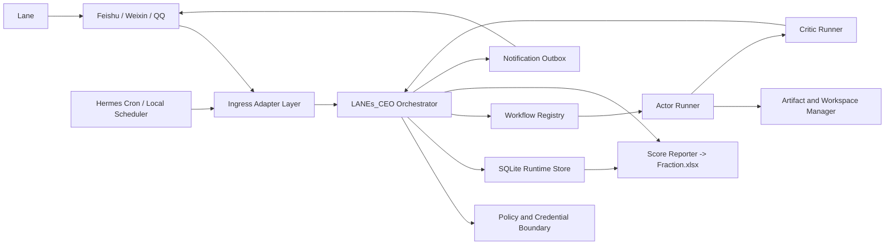

# LANEs_CEO V1 工程架构拆解

## 1. 设计结论

`LANEs_CEO` V1 不应从零重写消息网关和定时器。当前本地资产中，`G:\blog\claude_code_useage\hermes-agent` 已具备消息 gateway、cron 调度、Feishu、Weixin、QQBot 平台配置和子 agent 能力；`G:\blog\claude_code_useage\weekly-github-trending` 也已经是一条可复用的 GitHub 热点工作流。

V1 采用以下落地策略：

1. **复用 Hermes 作为消息入口与定时入口的候选运行底座**  
   先通过适配层接入 Feishu、Weixin、QQBot 和 cron，不把业务内核绑死在 Hermes 私有对象上。
2. **在本项目内实现独立领域内核**  
   任务契约、作业状态、actor/critic 审核门、评分、通知事件、文件产物和凭据引用都由 `LANEs_CEO` 自己建模与持久化。
3. **把业务角色做成工作流包**  
   论文调研、AI 新闻、GitHub 热点、邮箱摘要、日报、反思总结分别实现，均通过同一作业接口接入。
4. **按纵向可运行切片推进**  
   先跑通“任务进入 -> actor -> critic -> 评分 -> 通知”的闭环，再接真实消息渠道、定时任务和高敏登录工作流。

## 2. 架构视图



## 3. 核心边界

### 3.1 入口适配层

入口适配层只负责把外部事件转成 `TaskRequest`：

- Hermes Feishu 消息
- Hermes Weixin 消息
- Hermes QQBot 消息
- Hermes cron 或本地 scheduler 触发
- 本地开发 CLI 触发

入口适配层不负责业务判断，不直接落评分，不直接运行 actor。这样即使未来替换 Hermes，领域内核仍能保留。

### 3.2 领域内核

领域内核是本项目最重要的部分，负责：

- `TaskRequest`、`Job`、`Artifact`、`CriticReview`、`ScoreRecord`、`NotificationEvent` 数据契约。
- 作业状态机和 actor/critic 审核门。
- 幂等键、重试计数、失败原因和待用户确认状态。
- 任务评分、critic 评分和月度汇总入口。
- 审计事件和通知 outbox。

领域内核不直接依赖某个聊天 SDK、浏览器登录脚本或 Excel 实现。

### 3.3 工作流包

每个角色组实现同一工作流协议：

- 输入角色任务。
- 调用允许工具。
- 产出结构化 `Artifact`。
- 交给 critic 审核。
- 把需要 Lane 确认的事项单独声明。

V1 角色工作流包建议拆为：

| 工作流包 | 覆盖角色 | 首次落地优先级 |
| --- | --- | --- |
| `paper_writing` | 论文写作 actor/critic | 第二批，保留模板和人工输入边界 |
| `paper_research` | 论文调研 actor/critic | 第三批，需下载、笔记、引用和文件落盘 |
| `briefings` | GitHub 热点、AI 新闻 actor/critic | 第二批，先复用已有热点 Skill |
| `mail_digest` | 邮箱 actor/critic | 第四批，高敏登录和已读边界先后置 |
| `daily_loop` | 日报、反思 actor/critic | 第三批，适合作为定时对话闭环 |

### 3.4 持久化与报表

V1 运行态使用 SQLite。原因：

- 本地常驻服务部署轻。
- 任务、审核、评分和通知需要事务化写入。
- Excel 不适合作为并发运行账本。

SQLite 至少需要这些逻辑表：

| 表 | 用途 |
| --- | --- |
| `task_requests` | 外部指令和定时触发归档 |
| `jobs` | 作业状态、角色组、幂等键、失败原因 |
| `artifacts` | 产物摘要、路径、来源、风险和待确认事项 |
| `critic_reviews` | 审核评分、问题、是否放行、回流说明 |
| `score_records` | 单次评分和月度汇总来源 |
| `notification_events` | 通知目标、发送状态、重试记录 |
| `audit_events` | 登录失败、验证码、敏感动作和异常升级 |

`Fraction.xlsx` 由 reporter 从 SQLite 导出，不作为唯一事实源。

### 3.5 凭据和高敏动作

V1 在接口层兼容 `secret.md`，但领域内核只认识 `CredentialRef`，不传播明文凭据。

高敏工作流按以下分层处理：

1. 优先复用 CLI、MCP、官方连接。
2. 再考虑浏览器自动化登录。
3. 手机验证码和无法确认后果的动作进入 `WAITING_USER`。
4. 邮箱已读动作必须走邮件分类结果，论文拒稿、录用、审稿决定、修改意见邮件保持未读。

## 4. 推荐项目结构

```text
multi-agent/
|-- multi_agent.md
|-- docs/
|   |-- architecture/
|   `-- superpowers/plans/
|-- pyproject.toml
|-- src/lanes_ceo/
|   |-- __init__.py
|   |-- config.py
|   |-- contracts.py
|   |-- enums.py
|   |-- orchestrator.py
|   |-- policy.py
|   |-- storage/
|   |   |-- schema.py
|   |   `-- sqlite_store.py
|   |-- ingress/
|   |   |-- base.py
|   |   |-- cli.py
|   |   `-- hermes.py
|   |-- workflows/
|   |   |-- base.py
|   |   |-- registry.py
|   |   |-- briefings/
|   |   |-- paper_research/
|   |   |-- paper_writing/
|   |   |-- mail_digest/
|   |   `-- daily_loop/
|   |-- reporting/
|   |   `-- score_reporter.py
|   `-- notifications/
|       `-- outbox.py
|-- tests/
|   |-- unit/
|   `-- integration/
`-- runtime/
    |-- lanes_ceo.sqlite3
    |-- jobs/
    `-- artifacts/
```

`runtime/` 应加入忽略规则，不应把运行数据库、下载中间物和敏感会话文件提交到仓库。

## 5. 状态机建议

作业状态建议固定为：

| 状态 | 含义 |
| --- | --- |
| `RECEIVED` | 已接收请求 |
| `RUNNING_ACTOR` | actor 执行中 |
| `WAITING_REVIEW` | 等待 critic |
| `RETURNED_TO_ACTOR` | critic 驳回并回流 |
| `WAITING_USER` | 等待 Lane 确认、验证码或补充输入 |
| `APPROVED` | critic 已放行 |
| `NOTIFIED` | 已把正式结果发出 |
| `FAILED` | 已失败并保留原因 |

actor 不得直接把作业推进到 `NOTIFIED`。正式通知必须由 orchestrator 在 `APPROVED` 后发出。

## 6. 首轮工程批次

### 批次 A：领域内核闭环

目标：用本地 CLI 和 fake workflow 跑通统一契约、SQLite、actor/critic 审核门和通知 outbox。

交付：

- Python 项目骨架和测试基线。
- 数据契约、状态枚举和 SQLite store。
- workflow registry、fake actor、fake critic。
- actor 未放行不得通知的集成测试。

### 批次 B：真实入口和调度接入

目标：把 Hermes 候选网关接到领域内核。

交付：

- Hermes ingress adapter spike。
- Feishu、Weixin、QQBot 事件转 `TaskRequest`。
- cron 或 scheduler 事件转定时 `TaskRequest`。
- 飞书状态反馈、通知失败重试、幂等触发测试。

### 批次 C：低敏业务工作流

目标：先接最容易验证的内容型任务。

交付：

- 复用 `weekly-github-trending` 的 GitHub 热点工作流。
- AI 新闻 briefing 工作流。
- 日报和反思的定时对话骨架。
- 飞书文档和本地产物索引。

### 批次 D：论文工作流

目标：接入论文写作和论文调研，明确模板、数据和产物边界。

交付：

- `attention_paper.md` 驱动的论文调研。
- PDF 下载目录和版本化命名。
- 阅读笔记、基础知识扩展、来源追踪。
- 论文写作 actor/critic 的模板审查和特殊评级规则。

### 批次 E：高敏登录与运营硬化

目标：处理账号、报表和连续运行。

交付：

- 邮箱 digest、论文邮件保留未读规则。
- 凭据引用和 `secret.md` 兼容读取。
- DeepSeek 余额提醒。
- `Fraction.xlsx` reporter。
- 7 天运行观测、失败恢复和告警审计。

## 7. 关键验收顺序

工程推进时按以下顺序验收，避免角色越多、核心越虚：

1. 一个 fake actor/critic 作业可以完整落库并通过审核门。
2. 未放行作业不会发正式通知。
3. Feishu、Weixin、QQBot 三类入口能进入同一任务请求契约。
4. 定时触发具备幂等性和失败记录。
5. 低敏内容工作流能稳定产出并通知。
6. 论文工作流能稳定落盘和保留引用。
7. 邮箱、DeepSeek、Excel 和 7 天运行观测通过后再宣布 V1 可日常使用。

## 8. 主要风险

| 风险 | 处理 |
| --- | --- |
| Hermes 与本项目边界不清 | 只在 ingress adapter 依赖 Hermes，领域内核不依赖其内部状态 |
| 微信和 QQ 接入差异大 | 先做适配器 spike，再锁定配置与部署方式 |
| 邮箱网页登录不稳定 | 高敏工作流后置，优先测试官方连接和 CLI 能力 |
| Excel 并发写入 | 只从 SQLite 导出报表 |
| actor/critic 互相污染 | 工作流上下文、工作目录、产物路径和凭据引用隔离 |
| 工作流一次全接导致无法验收 | 按批次推进，每批都有可运行闭环 |

